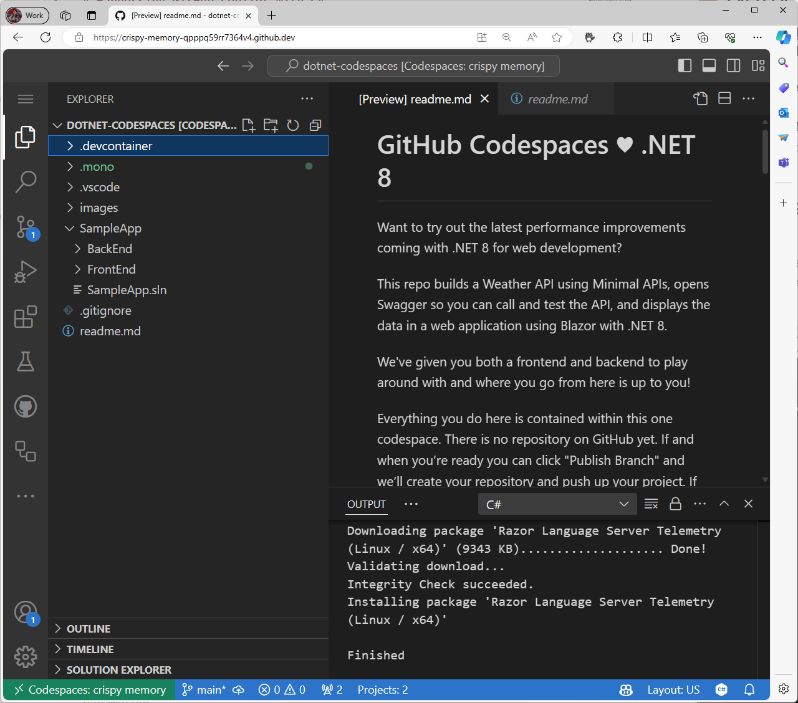
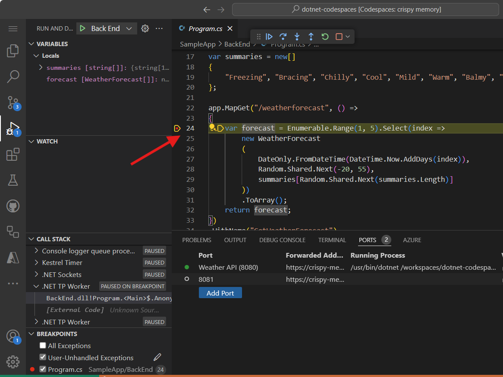
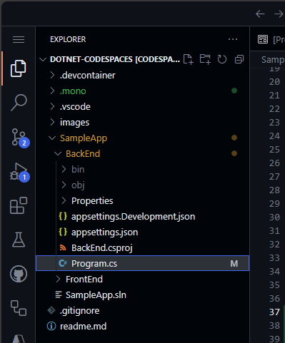

<header>

# Usando o GitHub Copilot com C#

O GitHub Copilot é a primeira ferramenta de desenvolvedor de IA em escala mundial que acelera significativamente a escrita de código, fornecendo sugestões no estilo de autocompletar enquanto você trabalha. Neste módulo, focaremos em usar o poder do GitHub Copilot para melhorar a eficiência da sua codificação em C#.

Como desenvolvedor, seu objetivo é aumentar a produtividade e acelerar os processos de codificação. O GitHub Copilot atua como seu programador parceiro de IA, oferecendo sugestões com base no contexto e nos padrões de código. Ao final deste módulo, você não apenas saberá como configurar o GitHub Copilot no Codespaces, mas também como gerar e implementar sugestões de código de forma eficaz.

Prepare-se para mergulhar em um cenário do mundo real! Você estará modificando um repositório C# usando o GitHub Copilot para criar um endpoint de API. Este projeto lhe dará uma experiência valiosa no desenvolvimento de um aplicativo web em C# que serve uma API HTTP, gerando informações de previsão do tempo pseudo-aleatórias.

</header>


- **Quem deve fazer**: Desenvolvedores, Engenheiros de DevOps, Gerentes de desenvolvimento de software, Testadores.
- **O que você vai aprender**: Como usar o GitHub Copilot para criar código e adicionar comentários ao seu trabalho.
- **O que você vai construir**: Arquivos C# que terão código gerado pela IA do Copilot para sugestões de código e comentários.
- **Pré-requisitos**: Para usar o GitHub Copilot, você deve ter uma assinatura ativa do GitHub Copilot. Inscreva-se por 30 dias grátis [Copilot](https://github.com/settings/copilot).
- **Duração**: Este curso pode ser concluído em menos de uma hora.

Ao final deste módulo, você adquirirá as habilidades para:

- Criar prompts para gerar sugestões do GitHub Copilot
- Aplicar o GitHub Copilot para melhorar seus projetos.

## Leitura recomendada:
- [Introdução à engenharia de prompts com o GitHub Copilot](https://learn.microsoft.com/training/modules/introduction-prompt-engineering-with-github-copilot?WT.mc_id=academic-113596-abartolo)

- [O que é a extensão GitHub Copilot para o Visual Studio?](https://learn.microsoft.com/en-us/visualstudio/ide/visual-studio-github-copilot-extension?view=vs-2022&WT.mc_id=academic-113596-abartolo)


## Requisitos

1. Habilite o seu [serviço GitHub Copilot](https://github.com/github-copilot/signup)

1. Familiarize-se com [este repositório com Codespaces](https://github.com/github/dotnet-codespaces)

## 💪🏽 Exercício

**Clique com o botão direito no seguinte botão Codespaces para abrir seu Codespace em uma nova aba**

[](https://codespaces.new/github/dotnet-codespaces)

O repositório "**GitHub Codespaces ♥️ .NET 8**" constrói uma API de Clima usando APIs Mínimas, abre o Swagger para que você possa chamar e testar a API, e exibe os dados em uma aplicação web usando Blazor com .NET 8.

Vamos revisar os passos para atualizar o aplicativo Weather BackEnd, adicionando um novo endpoint que solicita uma localização específica e retorna a previsão do tempo para essa localização.

### 🗒️ (Passo Opcional 1): Familiarize-se com o repositório "GitHub Codespaces ♥️ .NET 8"

Depois de abrir o repositório no Codespaces, você encontrará uma nova janela do navegador com um Codespace totalmente funcional. Tudo neste repositório está contido dentro deste único Codespace. Por exemplo, no painel do explorador, podemos ver o código principal para o projeto BackEnd e o projeto FrontEnd.



Para executar o projeto BackEnd, vá para o painel "Run and Debug" e selecione o projeto "BackEnd".


Comece a depuração do projeto selecionado. O projeto Weather API, nosso projeto BackEnd, agora estará em execução na porta 8080. Podemos copiar a URL publicada do painel *Ports*.


A aplicação BackEnd publicou um endpoint chamado `weatherforecast` que gera dados de previsão aleatórios. Para testar a aplicação em execução atual, você pode adicionar `/weatherforecast` à URL publicada. A URL final deve ser semelhante a esta

```bash
https://< your url>.app.github.dev/weatherforecast
```
A aplicação em execução em um navegador deve ser parecida com esta.


Agora vamos adicionar um ponto de interrupção em nossa aplicação para depurar cada chamada à API. Vá para o arquivo `Program.cs` no projeto BackEnd. O arquivo está no seguinte caminho `SampleApp\BackEnd\Program.cs`.

Adicione um ponto de interrupção na linha 24 (pressione F9) e atualize o navegador com a URL para testar o endpoint. O navegador não deve mostrar a previsão do tempo, e no Editor do Visual Studio, podemos ver como a execução do programa foi pausada na linha 24.



Pressionando F10, podemos depurar passo a passo até a linha 32, onde podemos ver os valores gerados. A aplicação deve ter gerado amostras de valores de previsão para os próximos 5 dias. A variável `forecast` contém um array com esses valores.


Você pode parar a depuração agora.

Parabéns! Agora você está pronto para adicionar mais recursos ao aplicativo usando o GitHub Copilot.

### 🗒️ (Passo Opcional 2): Familiarize-se com os Comandos Slash do GitHub Copilot

À medida que começamos a trabalhar em nossa base de código, geralmente precisamos refatorar algum código ou obter mais contexto ou explicações sobre ele. Usando o GitHub Copilot Chat, podemos ter conversas guiadas por IA para realizar essas tarefas.

Abra o arquivo `Program.cs` no projeto BackEnd. O arquivo está no seguinte caminho `SampleApp\BackEnd\Program.cs`.

Agora vamos usar um comando slash no GitHub Copilot para entender um trecho de código. Selecione as linhas 22-35, pressione `CTRL + I` para abrir o chat inline e digite `/explain`.


No Painel de Chat, o GitHub Copilot criará uma explicação detalhada do código selecionado. Uma versão resumida será algo como:


```
O código C# selecionado faz parte de uma aplicação ASP.NET Core usando o recurso de API mínima. Ele define um endpoint GET em "/weatherforecast" que gera um array de objetos WeatherForecast. Cada objeto é criado com uma data, uma temperatura aleatória e um resumo aleatório. O endpoint é nomeado "GetWeatherForecast" e possui suporte OpenAPI para documentação padronizada da estrutura da API.
```

**Comandos Slash** são comandos especiais que você pode usar no chat para realizar ações específicas no seu código. Por exemplo, você pode usar:
- `/doc` para adicionar um comentário de documentação
- `/explain` para explicar o código
- `/fix` para propor uma correção para os problemas no código selecionado
- `/generate` para gerar código para responder à sua pergunta

Vamos usar o comando `/tests` para gerar testes para o código. Selecione as linhas 39-42, pressione `CTRL + I` para abrir o chat inline e digite `/tests` (ou selecione o comando /tests) para gerar um novo conjunto de testes para este código.


Neste ponto, o GitHub Copilot sugerirá uma nova classe. Você precisa primeiro pressionar [Create] para criar o novo arquivo.

Uma nova classe `ProgramTests.cs` foi criada e adicionada ao projeto. Estes testes estão usando XUnit, no entanto, você pode pedir para gerar testes usando outra biblioteca de teste unitário com um comando como este `/tests use MSTests for unit testing`.

***Importante:** Não vamos usar o arquivo de teste neste projeto. Você deve excluir o arquivo de teste gerado para continuar.*

Finalmente, vamos usar o comando `/doc` para gerar documentação automática para o código. Selecione as linhas 39-42, pressione `CTRL + I` para abrir o chat inline e digite `/doc` (ou selecione o comando) para gerar a documentação para este registro.


O chat inline, o Painel de Chat e os comandos slash são partes das ferramentas incríveis que apoiam nossa experiência de desenvolvimento com o GitHub Copilot. Agora estamos prontos para adicionar novos recursos a este aplicativo.

### 🗒️ Passo 1: Gere um novo Registro que inclua o nome da cidade

Vá para o arquivo `Program.cs` no projeto BackEnd. O arquivo está no seguinte caminho `SampleApp\BackEnd\Program.cs`. 



Navegue até o final do arquivo e peça ao Copilot para gerar um novo registro que inclua o nome da cidade.

```csharp
// Crie um novo registro interno chamado `WeatherForecastByCity` que solicite os seguintes parâmetros: `City`, `Date`, `TemperatureC`, `Summary`.
```

O código gerado deve ser semelhante a este:

```csharp
// Cria um novo registro interno chamado WeatherForecastByCity que solicita os seguintes parâmetros: City, Date, TemperatureC, Summary
internal record WeatherForecastByCity(string City, DateOnly Date, int TemperatureC, string? Summary)
{
    public int TemperatureF => 32 + (int)(TemperatureC / 0.5556);
}
```

Você pode ver o prompt funcionando na próxima animação:

!open program.cs in the BackEnd project

### 🔎 Passo 2: Gerar um novo endpoint para obter a previsão do tempo para uma cidade

Agora vamos gerar um novo endpoint de API semelhante ao `/weatherforecast` que também inclua o nome da cidade. O nome do novo endpoint da API será **`/weatherforecastbycity`**.

***Importante:** Você deve colocar o código após a linha '.WithOpenApi();', que começa na linha 36. Lembre-se também de pressionar TAB em cada nova linha sugerida até que todo o endpoint esteja definido.*

Em seguida, gere um novo endpoint com o GitHub Copilot adicionando o comentário:

```csharp
// Crie um novo ponto de extremidade chamado /WeatherForecastByCity/{city}, que aceita um nome de cidade nas URLs como parâmetro e gera uma previsão aleatória para essa cidade
```
No exemplo a seguir, adicionamos algumas linhas em branco extras após o endpoint anterior e, em seguida, o GitHub Copilot gerou o novo endpoint. Uma vez que o código principal do Endpoint foi gerado, o GitHub Copilot também sugeriu o código para o nome do endpoint (linha 49) e a especificação OpenAPI (linha 50). Lembre-se de aceitar cada uma dessas sugestões pressionando [TAB].


***Importante**: Este prompt gera várias linhas de código C#. É fortemente aconselhável verificar e revisar o código gerado para garantir que ele funcione da maneira desejada.*

O código gerado deve ser semelhante a este:

```csharp
// Crie um novo endpoint chamado /WeatherForecastByCity/{city}, que aceita o nome de uma cidade na URL como parâmetro e gera uma previsão aleatória para essa cidade.
app.MapGet("/WeatherForecastByCity/{city}", (string city) =>
{
    var forecast = new WeatherForecastByCity
    (
        city,
        DateOnly.FromDateTime(DateTime.Now),
        Random.Shared.Next(-20, 55),
        summaries[Random.Shared.Next(summaries.Length)]
    );
    return forecast;
})
.WithName("GetWeatherForecastByCity")
.WithOpenApi();
```


### 🐍 Etapa 3: Testar o novo endpoint

Finalmente, verifique se o novo endpoint está funcionando iniciando o projeto a partir do painel "Run and Debug". 
Selecione "Run and Debug" e, em seguida, selecione o projeto "BackEnd".


Agora, pressione "Run" e o projeto deve ser compilado e executado. Uma vez que o projeto esteja em execução, podemos testar a URL original usando a URL do seu Codespace e o endpoint original:

```bash
https://< your code space url >.app.github.dev/WeatherForecast
```

E o novo endpoint também estará pronto para teste. Aqui estão algumas URLs de amostra com diferentes cidades:
```bash
https://< your code space url >.app.github.dev/WeatherForecastByCity/Toronto

https://< your code space url >.app.github.dev/WeatherForecastByCity/Madrid

https://< your code space url >.app.github.dev/WeatherForecastByCity/<AnyCityName>
```

Os testes devem resultar em algo semelhante a isso:


🚀 Parabéns, através do exercício, você não só utilizou o GitHub Copilot para gerar código, mas também fez isso de uma maneira interativa e divertida! Você pode usar o GitHub Copilot não apenas para gerar código, mas também para escrever documentação, testar suas aplicações e muito mais.


## Avisos Legais

A Microsoft e quaisquer colaboradores concedem a você uma licença para a documentação da Microsoft e outros conteúdos
neste repositório sob a Licença Pública Internacional Creative Commons Attribution 4.0,
veja o arquivo [LICENSE](LICENSE), e concedem a você uma licença para qualquer código no repositório sob a [MIT License](https://opensource.org/licenses/MIT), veja o
arquivo [LICENSE-CODE](LICENSE-CODE).

Microsoft, Windows, Microsoft Azure e/ou outros produtos e serviços Microsoft referenciados na documentação
podem ser marcas comerciais ou marcas registradas da Microsoft nos Estados Unidos e/ou em outros países.
As licenças para este projeto não concedem a você direitos de uso de quaisquer nomes, logotipos ou marcas comerciais da Microsoft.
As diretrizes gerais de marcas registradas da Microsoft podem ser encontradas em http://go.microsoft.com/fwlink/?LinkID=254653.

Informações sobre privacidade podem ser encontradas em https://privacy.microsoft.com/en-us/

A Microsoft e quaisquer colaboradores reservam todos os outros direitos, seja sob seus respectivos direitos autorais, patentes,
ou marcas comerciais, seja por implicação, preclusão ou de outra forma.